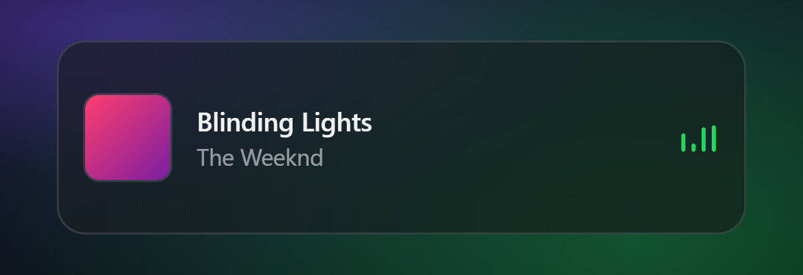
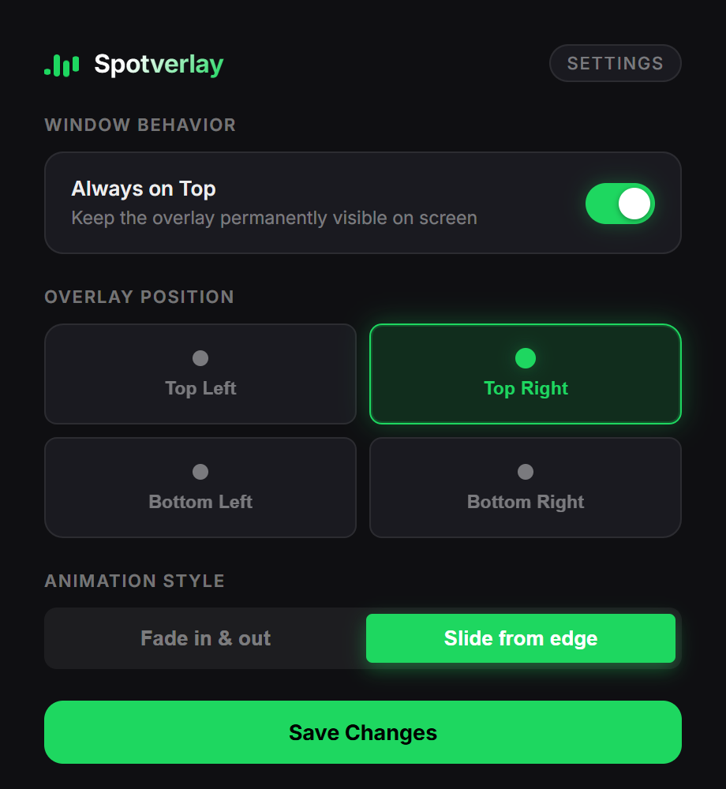

# spotverlay

A simple, always-on-top overlay that shows what's playing on Spotify, [Spotifast](https://github.com/crmne/spotifast), [SpotLight](https://github.com/dddevid/SpotLight), Apple Music, or [Musly](https://github.com/dddevid/Musly) when the track changes. Built so you don't have to alt-tab out of a game or whatever you're doing just to see the song name.

Originally written in Electron, I rewrote this in Tauri + Rust. It now idles at around ~10MB of RAM instead of ~80MB, and the binary is much smaller. It supports Windows, macOS, and Linux.

<p align="center">
  <video src="https://github.com/dddevid/Spotverlay/raw/master/assets/showcase.mp4" width="720" controls></video>
  <br>
  <a href="https://github.com/dddevid/Spotverlay/blob/master/assets/showcase.mp4">
    <b>▶️ Clicca qui per vedere il video con l'audio se il player non funziona</b>
  </a>
</p>

## screenshots

<table>
  <tr>
    <td align="center"><br><sub>the overlay</sub></td>
    <td align="center"><br><sub>settings</sub></td>
  </tr>
</table>

> [!NOTE]
> **Linux Users:** The Linux version (D-Bus MPRIS2) has been implemented but has not been heavily tested yet. If you run into any issues (e.g. track not updating or overlay not showing), please [open an issue](https://github.com/dddevid/Spotverlay/issues), it helps a lot!

## GitAds Sponsored 
[](https://gitads.dev/v1/ad-track?source=dddevid/spotverlay@github)
*This project is maintained thanks to GitAds Sponsors.*

## how it works under the hood

Spotverlay doesn't use any official web APIs, so you don't need to mess with OAuth tokens or developer apps. It just asks the OS what media is currently playing:

*   **Windows**: Uses `windows-rs` to read from SMTC (System Media Transport Controls).
*   **macOS**: Runs an AppleScript (`osascript`) to query the media player process directly.
*   **Linux**: Listens to D-Bus via the MPRIS2 interface (using `zbus`).

Because the local OS APIs often return low-quality or cached album art, the app takes the artist and track name and pings the public iTunes Search API to grab a clean 600x600 cover.

<details>
<summary><b>Why not use the Windows 11 SMTC cover art?</b></summary>
The Windows 11 System Media Transport Controls (SMTC) API has a known issue with Spotify where the album thumbnail is often heavily cached (showing a song from hours ago), severely compressed/blurry, or sometimes completely null. Because the text metadata (artist and title) updates instantly and reliably, Spotverlay ignores the native thumbnail and fetches a high-quality cover from iTunes instead.
</details>

When a track changes, the overlay slides/fades in, stays for a few seconds, and hides itself again. It's fully click-through, so it won't steal your mouse focus.

## settings

There's a tray icon. Right-click it (or left-click) to open settings where you can change the position (corners), animation style (fade/slide), and toggle if you want it permanently visible instead of auto-hiding. Settings are saved locally as a simple JSON file.

---

## troubleshooting

**macOS: "Spotverlay is damaged and can't be opened"**
This is a standard macOS Gatekeeper error for apps downloaded outside the Mac App Store that don't have a paid Apple Developer certificate. It's not actually damaged, it's just quarantined.
To fix it, download the `.dmg` and drag the app into your **Downloads** folder (not Applications yet). Then open your Terminal and run:
```bash
xattr -cr ~/Downloads/Spotverlay.app
```
Now you can move it to your Applications folder and open it normally.
